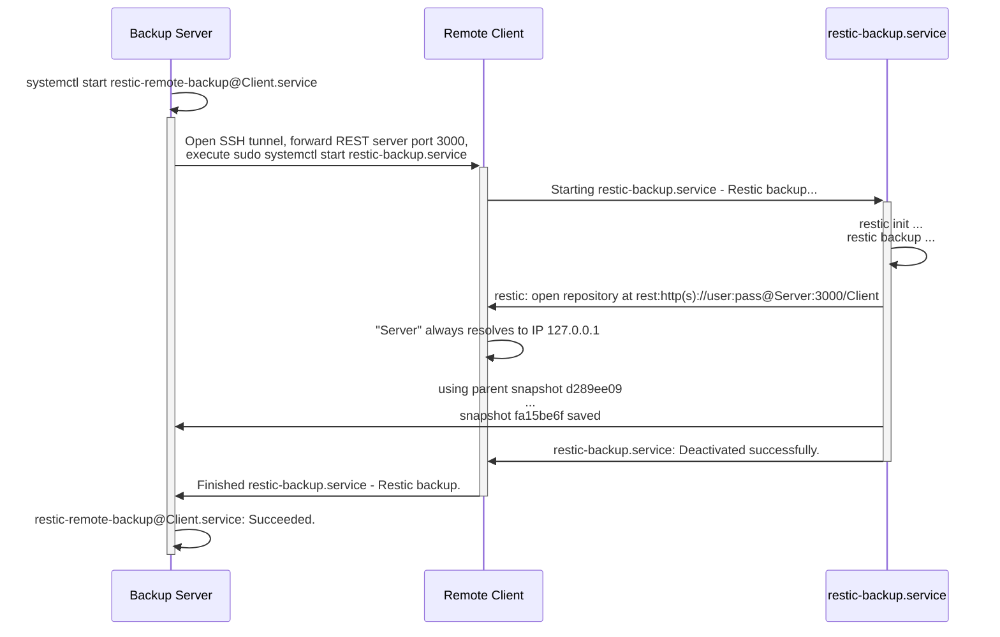

# Description
This role configures automated backups for remote backup clients which cannot reach the backup server directly, e.g. due to firewalls, NAT, etc. The backup server must be able to reach the remote client via SSH.

<details><p><summary>Flowchart</summary>


</p></details>

You can regard this role as kind of an extension to the `fifty2technology.restic_client` role, as they are both integrated into each other, but it once made more sense to unload the `restic_client` role and separate the "remote client" functionality from it. It is also coupled with the `fifty2technology.restic_server` role, since the backup server needs to be configured to connect to remote clients - this means it can only work with clients with a [restic REST server](https://github.com/restic/rest-server) account configured as a repository.

This role configures both restic remote clients (machines that need files backed up) and the restic REST server (which hosts the restic repositories). Once this role is deployed, the backup server starts a systemd service `restic-remote-backup@<remote-client>.service`, which initiates an SSH connection, forwarding the backup server's port to the remote restic client via SSH and then invoking the `restic-backup.service` there.

Once a week (on saturday night) the backup server also connects to each remote client and runs the `restic-prune.service`.

For monitoring purposes and if configured, the backup server connects to each remote machine once every day via `restic-remote-exporter@.service` to gather metrics about the latest backup snapshot. This cannot be done by the client itself since it requires access to the restic repository on the server.

# Requirements
* The variable `restic_client_is_remote` must be set to `true` to enable remote backups. It must also be set during `restic_client` role deployment so it configures and activates systemd services correctly.
* `backup_server` must be set to the `inventory_hostname` of the backup server, e.g. `backupserver.example.com`.
* `backup_server_password` must contain the login credentials for the backup server.
* `backup_server_become_password` must contain the privilege escalation password for the unprivileged user on the backup server.

The `backup_server`\* variables are necessary so that `delegate_to` tasks to the backup server are run correctly. It shouldn't be necessary if you use SSH login with keys and/or as privileged user.

# Role Variables
All variables which can be overridden are stored in defaults/main.yml file as well as in table below.

| Name | Default value | Description |
| ------ | ------ | ----- |
| `restic_remote_client_rest_password` | `"{{ restic_client_rest_password \| default( lookup('passwordstore', 'IT/backup/auth/' + inventory_hostname) ) }}"` | Read REST authentication password from the passwordstore. If it does not exist yet, let the relevant task fail. This password should have been generated by the `restic_client` role, which is a prerequisite for this role. |
| `restic_remote_server_user` | `"{{ restic_server_user \| default('rest-server') }}"` | Username to use for initiating SSH connections as from server to client |
| `restic_remote_server_group` | `"{{ restic_server_group \| default('rest-server') }}"` | Groupname used to assert that a SSH private/public keypair exists with correct ownership on the server. The keypair should exist already (created in `restic_server` role). |
| `restic_remote_client_port` | `"{{ restic_server_listen_port \| default('3000') }}"` | Port to use on client side to terminate SSH tunnel coming from the backup server. Set to a port not used by something else on the client. Defaults to the same port the `restic_server` role uses to let the REST server listen on. |
| `restic_remote_client_user` | `"{{ restic_client_user \| default('restic') }}"` | Username used by the server to connect to the client via SSH. The server then starts the `restic-backup.service` as this user via `sudo systemctl start restic-backup.service`. |
| `restic_remote_ssh_port` | 22 | SSH port of the client, which will be used by the backup server to connect. |
| `restic_remote_client_group` | `"{{ restic_client_group \| default('restic') }}"` | Groupname getting granted `sudo` privileges on client to start systemd services `restic-backup.service` and `restic-prune.service`. The client's user must be in this group. |
| `restic_remote_client_home` | `"{{ restic_client_home \| default('/home/' + restic_remote_client_user) }}"` | Construct config directory from `restic_client` defaults. Required for placing the `repository` file to the correct location. |
| `restic_remote_client_config_dir` | `"{{ restic_client_config_dir \| default(restic_remote_client_home + '/.config/restic') }}"` | See comment of `restic_remote_client_home` above |
| `restic_remote_client_is_remote` | `"{{ restic_client_is_remote \| default(false) }}"` | Repeat from `restic_client` role to check whether client should be configured to be backed up remotely by the backup server. |
| `restic_remote_no_log` | true | Do not show sensible content when printed by `ansible-playbook` runs. Set to `false` for debugging e.g. repository file templating. |

# Dependencies
The `restic_client` role must be run on targets beforehand, and the `restic_server` role for the restic rest-server must be deployed already.

# Example Playbook
```
- hosts: all
  gather_facts: false
  become: true

  vars:
    restic_client_is_remote: true
    backup_server: backupserver.example.com
    backup_server_password: supersecurepassword
    backup_server_become_password: supersecurebecomepassword

  roles:
    - role: restic_client
    - role: restic_remote
```

## Testing with Molecule
Example how to fully test the whole `restic_remote` role from deploy to a remote backup trigger:
1. Run `molecule converge`
2. Run `molecule login -h backupserver` to login to the backupserver container.
   1. Run `systemctl start restic-remote-backup@restic_remote_debian12.service` to test if the backup is working.
   2. Run `journalctl -fe` to check for possible errors.
3. Run `molecule login -h restic_remote_debian12`
   1. Run `journalctl -ft restic` to check for possible errors.

Dependig on the container environment, molecule containers might not be able to resolve each others hostnames, breaaking the SSH connection attempts in the `restic-remote-backup@<remote-client>.service`. In this case, add the `restic_remote_debian12` hostname to `/etc/hosts` manually on the `backupserver`. In a productive setup, hostnames must be resolvable via DNS.
